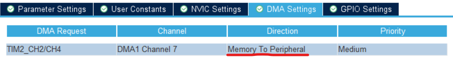
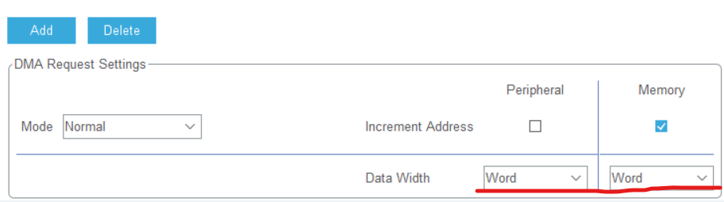

# WS2812_STM32F103C8T6

基于STM32F103C8T6驱动级联WS2812，使用PWM+DMA的方式

STM32F103C8T6 based driver cascade WS2812 using PWM+DMA

<mark>**注意！！！**</mark>
<mark>**在CubeMX配置PWM+DMA时，一定要修改传输方向：**</mark>
**WS2812灯条必须用外部电源供电，本项目使用的是8x8的灯板，使用学生电源5V供电，输出电流约为0.6A，功率较大，因此不能使用电脑的USB进行供电**
<mark>**采用外部供电时，单片机和灯条必须共地，否则会出现PWM电平无法正常读取导致的时序错误**</mark>

<mark>**Note!!!**</mark>
<mark>**When configuring PWM+DMA in the CubeMX, be sure to modify the transmission direction:**</mark>
**WS2812 light bar must be powered by an external power supply, this project uses an 8x8 light board, using a student power supply 5V power supply, the output current is about 0.6A, the power is larger, so you can not use the computer's USB for power supply!**
<mark>**When using an external power supply, the microcontroller and the light bar must share a common ground, otherwise there will be timing errors caused by the PWM level not being read properly**</mark>


DMA传输的位宽要与代码中的**传输位宽一致**：

The bit width of the DMA transfer should be the same as the **Transfer Bit Width** in the code:

**Word**is**uint32**，**Half Word**is**uint16**

选择**Normal**模式，整个传输过程**只能进行一次**，并且最后一个数据会一直存留在PWM计数器中作为PWM的占空比

By selecting **Normal** mode, the entire transmission process **can only be performed once** and the last data will always be stored in the PWM counter as PWM duty cycle

选择**Circular**模式，整个传输过程会**一直进行**。

By selecting **Circular** mode, the entire transmission process will **always proceed**.

回调函数

callback function

```c
    void HAL_TIM_PWM_PulseFinishedCallback(TIM_HandleTypeDef *htim)
```

会在每一次传输结束后执行，用户可以自行定义其中的内容；在这里可以调用函数

will be executed at the end of each transmission, and the user can define the contents of it; here you can call the function

```c
    HAL_StatusTypeDef HAL_TIM_PWM_Stop_DMA(TIM_HandleTypeDef *htim, uint32_t Channel)
```

来停止DMA传输

to stop DMA transfers

*WS2812的信号频率为800KHz，单个灯珠的色彩为24位：8位Green->8位Red->8位Blue，高位在前；bit0为33%的占空比，bit1为66%的占空比，对所有灯珠传输完毕需要发送复位字节，即一个>50us的电平*
*因此需要配置PWM的频率为800kHz，即时钟频率/TIM预分频/PWM计数值=800KkHz，请根据单片机的时钟主频自行计算*

*The signal frequency of WS2812 is 800KHz, and the colour of a single lamp bead is 24 bits: 8 bits Green->8 bits Red->8 bits Blue, with the high bit in the front; bit0 is 33% duty cycle, and bit1 is 66% duty cycle, and a reset byte needs to be sent to the end of the transmission for all the lamp beads, i.e., a >50us level*
*Therefore, it is necessary to configure the frequency of the PWM as follows 800kHz, i.e. clock frequency / TIM pre-divider / PWM count = 800KkHz, please calculate according to the clock frequency of the microcontroller.*
